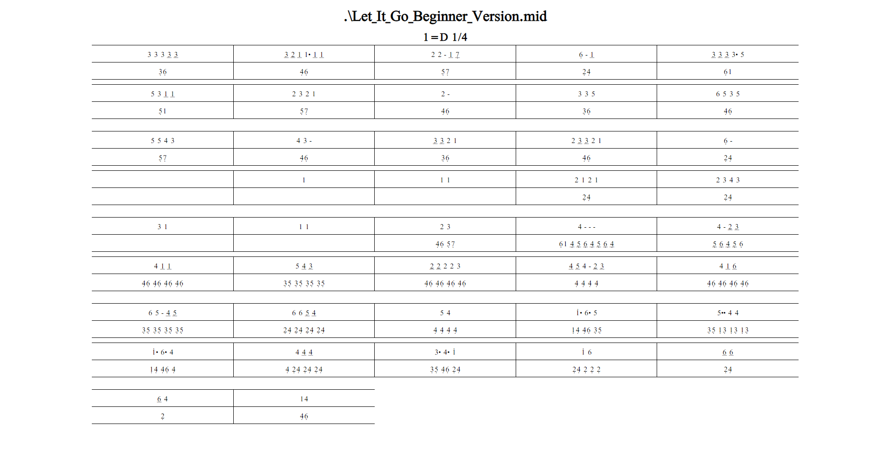

# Midi To Jianpu

A work in progress program that converts .mid files to Jianpu notation.

It is nowhere near done and a complete rewrite might be required to achieve full functionality.


## Demo




## Installation

Install my-project with pip

```bash
  pip install -r requirements.txt
```
    
## Features

- Convert to HTML (main)
- Convert to docx (would not recommend using)


## Roadmap

- Fix line and dot being too close to each other
- Fix spacing
- Fix errors that occur on certain .mid files
- Full rewrite using C# instead of Python

## Author

- [@Akina](https://www.github.com/kaajjaak)

